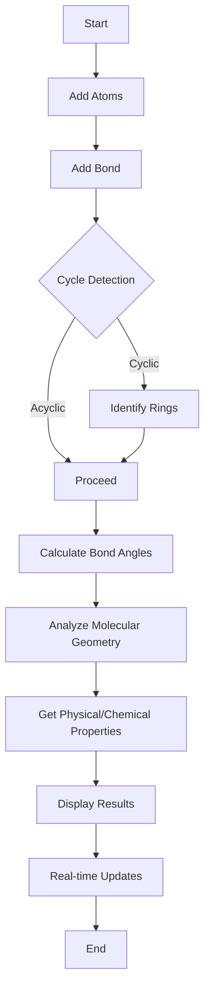

# Molecule Visualizer

Molecule Visualizer is an innovative data structures and algorithms initiative designed to represent and manipulate chemical molecules in a three-dimensional space using graph data structures.
Each atom is represented as a node, and each bond as an edge, allowing for a flexible and dynamic representation of molecular structures.
The construction of the molecular graph employs Breadth-First Search (BFS) to ensure comprehensive and systematic node traversal, facilitating the accurate assembly of the molecule. Depth-First Search (DFS) is implemented for cycle detection, crucial for identifying rings and complex substructures within the molecule.

## Key Features

* Detailed information sharing about the constructed molecules **Physical** and **Chemical** Properties.
* Bond angle calculations and molecular geometry analysis.
* Algorithmic efficiency for real-time updates and smooth interactions.

## Tech Stack

**Client:** React JS, Material UI, Tailwind CSS

**Server:** Node JS, Express JS

**Plotting:** Plotly JS

## Contributing

Contributions are always welcome!

See `contributing.md` for ways to get started.

Please adhere to this project's `code of conduct`.

## API Utilized

[Gemini 1.5 Flash](https://ai.google.dev/gemini-api/docs/models/gemini#gemini-1.5-flash)

## API Documentation

[API-Reference](/Backend/README.md)

## Environment Variables

To run this project, you will need to add the following environment variables to your .env file

`PORT`

`API_KEY`

## Developers

- `Tharun Kumarr A`
- `Naganathan M R`
- `Lowkik Sai P`
- `Praveen K`
- `Bharath S`
- `Hariprasath M`

## Future Ideas for **Molecule Visualizer**:

* **Validation** of the compounds that has be entered by the user.
* **Extending** the available hybridisation of molecules to **sp3d** and **sp3d2**.
* **Allowing** for various type of elements available in the periodic table. 

## FAQ

#### How to build the Molecule ?

* **Add Atoms:** Navigate to the menu bar at the right side of the page. Initially you need to add all the atoms with respective **hybridisations** that are present in your molecule using the **Add Atoms** menu.

* **Add Bond:** Menu in the right side will be comprising a option named **Add Bond**. Using this option select respective two atoms and the type of bond `Single, Double, Triple`. Then add bond will connect those two atoms in the 3d space.

#### What are these Examples ?

* These are prebuilt molecule templates for visualizing. These include the most common **Organic** and **Inorganic** compounds for fast visualization.

#### How to find if a Molecule is Cyclic/Acyclic ?

* Once you constructed the molecule using the option available, you can see the **Check Cycle** information in the bottom of the menu bar present at the right. This indicates whether the constructed molecule is **Cyclic** or **Acyclic**.

#### How get properties of constructed moelcule ?

* Once you have constrcuted the molecule, use the option **Get Data** available at the top left. This option when trigerred whill fetch you all the **Chemical** and **Physical** Properties of the molecule that has been constrcuted.

